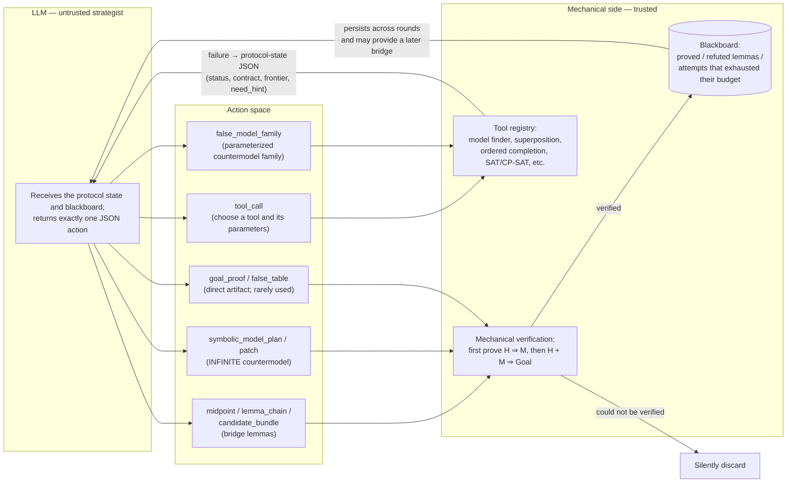
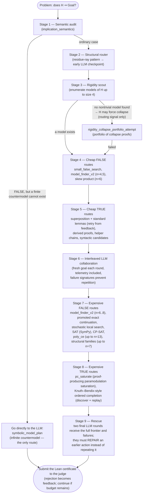

# Reja23 (EQT02-S00023) — Solver Strategy Diagram

This document visualizes Part 1 of `SOLVER_STRATEGY.md`. It contains two diagrams:
(1) the collaboration loop between the LLM and trusted mechanical tools, and (2) the
main solving loop, organized into increasingly expensive stages.

## Before reading the diagrams

- `H` is the hypothesis equation that every candidate magma must satisfy.
- `Goal` is the equation that the solver must prove or disprove.
- `H ⇒ Goal` asks whether every magma satisfying `H` must also satisfy `Goal`.
- A **TRUE certificate** is a Lean proof of the implication.
- A **FALSE certificate** is a countermodel: a magma in which `H` holds but `Goal`
  fails.
- The LLM is treated as an idea generator, not as a trusted source. Lean and the
  deterministic tools are the trust boundary.

## 1. Core idea — the LLM navigates, mechanical tools prove

### What each component does

1. **LLM strategist:** Reads the current goal, results from earlier searches, and
   reusable facts on the blackboard. It proposes one next action in a constrained
   JSON format.
2. **`tool_call`:** Asks the trusted tool registry to run a specific proof or
   countermodel search with explicit parameters and a bounded budget.
3. **`midpoint`, `lemma_chain`, and `candidate_bundle`:** Propose one intermediate
   equation, an ordered sequence of equations, or several candidates. These are
   “bridges” intended to connect `H` to `Goal`; they are not accepted until the
   mechanical side proves them.
4. **`false_model_family`:** Describes a compact, parameterized family of finite
   operations. Mechanical code expands candidates, checks that `H` holds, and checks
   that `Goal` fails.
5. **`symbolic_model_plan` / `patch`:** Builds an infinite countermodel in Lean, or
   repairs only the part of a previously rejected symbolic model that failed. This is
   needed when no finite countermodel can exist.
6. **`goal_proof` / `false_table`:** Supplies a complete proof or a complete finite
   operation table directly. This route is rare because asking the LLM for smaller
   hints that tools can verify is usually safer.
7. **Mechanical verifier:** For a proposed midpoint `M`, it separately proves that
   `H` implies `M`, then uses `H` together with `M` to prove `Goal`. A proposed
   countermodel is likewise checked rather than trusted.
8. **Tool registry:** Contains the deterministic and proof-producing search methods,
   including finite-model search, superposition, ordered completion, SAT, and CP-SAT.
9. **Blackboard:** Retains useful results across LLM rounds: lemmas that were proved,
   candidates that were refuted, and attempts that ran out of budget. This prevents
   later rounds from starting from scratch.
10. **Feedback loop:** A failed tool call is converted into structured telemetry using
    `sair-collab-protocol-v0`. Fields such as the search frontier and `need_hint` tell
    the next LLM round what almost worked and what kind of help is needed.
11. **Silent discard:** An unverifiable suggestion contributes no fact to the final
    answer. It may still produce failure information, but it can never become a
    certificate by itself.

The governing rule is that the LLM normally never writes a proof that is submitted
without checking. Every suggestion must pass mechanical verification. Bad suggestions
are discarded, while useful failure details become input for the next collaboration
round.

## 2. Main solving loop — escalate with the available budget

This diagram emphasizes the **fall-through path**: if a stage finds no certificate,
the solver advances to the next, more expensive stage. If any stage does find a proof
or countermodel, the candidate is checked by the Lean judge immediately and the solver
can finish early.

### What each stage does

1. **Semantic audit:** Determines what kind of answer is logically possible. In
   particular, it distinguishes failure of the unrestricted implication from failure
   on finite magmas. If the implication is false but all finite magmas satisfy it,
   finite-table searches are pointless, so the solver must construct an infinite
   symbolic countermodel.
2. **Structural router:** Examines the syntax of `H` for recognizable shapes. A
   residue-ray shape suggests a specialized infinite, residue-controlled operation
   family, so the solver asks the LLM early whether that route is appropriate.
3. **Rigidity scout:** Exhaustively looks for small nontrivial models of `H`, up to
   carrier size 4. Finding none is evidence that `H` may force every element to be
   equal or force a similarly rigid structure. It is only a routing hint, not a proof.
4. **Collapse-proof portfolio:** When the rigidity signal fires, tries several
   proof-producing chains of cancellation, projection, square, or constant laws. The
   aim is to prove that every model of `H` collapses to a trivial form, from which the
   goal follows automatically.
5. **Cheap FALSE routes:** Tries to disprove the implication quickly by finding a
   small finite operation table. It starts with sizes 4 and 5 and also tries a compact
   size-6 skew-product construction.
6. **Cheap TRUE routes:** Tries inexpensive ways to prove the implication: bounded
   superposition, standard auxiliary lemmas, mechanically derived facts, short helper
   chains, and candidates suggested by the equation's syntax. Failed searches can be
   retried using their closest proof frontier.
7. **Interleaved LLM collaboration:** Lets the LLM choose tools or propose bridge
   lemmas after it sees concrete mechanical feedback. A failure signature records each
   unsuccessful action so the LLM cannot waste later rounds by repeating it unchanged.
8. **Expensive FALSE routes:** Broadens the countermodel search to larger carriers and
   costlier algorithms. “Promoted exact continuation” turns a promising partial search
   into a more exact follow-up; stochastic search explores likely tables, SAT and
   CP-SAT encode the constraints for solvers, `poly_ce` tries polynomial operations,
   and structural families search compact algebraic constructions.
9. **Expensive TRUE routes:** Uses more powerful equational theorem proving.
   `pc_saturate` repeatedly applies proof-producing paramodulation rules. Ordered
   completion orients equations into rewrite rules, discovers a route to the target,
   and then replays that route as a checkable Lean proof.
10. **Rescue rounds:** Gives the LLM the complete search frontier and accumulated
    failures for two final attempts. It is explicitly asked to repair an almost-working
    action rather than repeat a search already known to fail.
11. **Judge submission:** The final artifact is Lean code, so the judge checks the
    result independently. Acceptance ends the solve; a rejection is recorded as
    structured feedback and another route may be attempted while budget remains.

The order is deliberately **cheap before expensive** and alternates between FALSE-side
countermodel search and TRUE-side proof search. This avoids committing the full budget
to the wrong answer direction too early.

## 3. One-line comparison

| Measure | reja23 | EQT02-M00006 (ours) |
|---|---|---|
| Philosophy | Broad search guided by the LLM | Deterministic ladder; verify before submission |
| Score (out of 800) | 762 | 786 |
| Rejected submissions | 252 | 0 |
| LLM dependency | Structural: routing and bridge lemmas | None: scores 786/800 with the LLM disabled |

The comparison highlights the tradeoff: `reja23` explores more broadly and uses the
LLM to steer important choices, while `EQT02-M00006` relies on a fixed sequence of
verified methods. The latter scored higher in this run and avoided rejected
submissions, but the table alone does not establish that it will dominate on every
problem set.
