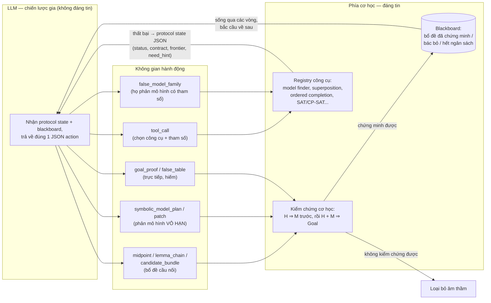

# Reja23 (EQT02-S00023) — Sơ đồ chiến lược

Sơ đồ hóa từ `SOLVER_STRATEGY.md` (Part 1). Hai sơ đồ: (1) vòng cộng tác LLM ↔ công cụ
cơ học, (2) vòng giải chính theo từng giai đoạn.

## 1. Ý tưởng cốt lõi — LLM điều hướng, công cụ cơ học chứng minh

Nguyên tắc: LLM **không bao giờ** viết chứng minh được nộp trực tiếp (trừ vài ngoại lệ
hẹp). Mọi gợi ý đều phải qua kiểm chứng cơ học; gợi ý hỏng bị vứt, thất bại của công cụ
được đóng gói thành telemetry (`sair-collab-protocol-v0`) nuôi vòng LLM kế tiếp.

## 2. Vòng giải chính — leo thang theo ngân sách

## 3. Đối chiếu một dòng

| | reja23 | EQT02-M00006 (ta) |
|---|---|---|
| Triết lý | Độ rộng + LLM điều hướng | Bậc thang tất định, kiểm chứng trước khi nộp |
| Điểm số (800) | 762 | 786 |
| Nộp bị bác bỏ | 252 | 0 |
| Phụ thuộc LLM | Cấu trúc (routing, cầu nối) | Không (786/800 khi tắt LLM) |
