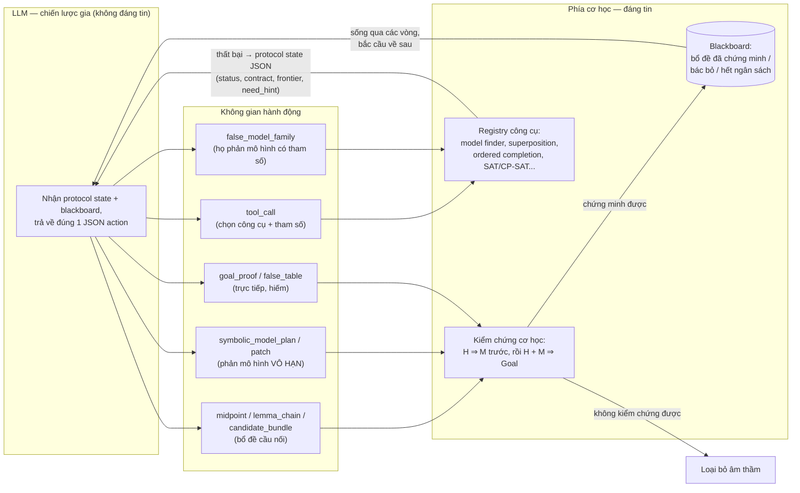
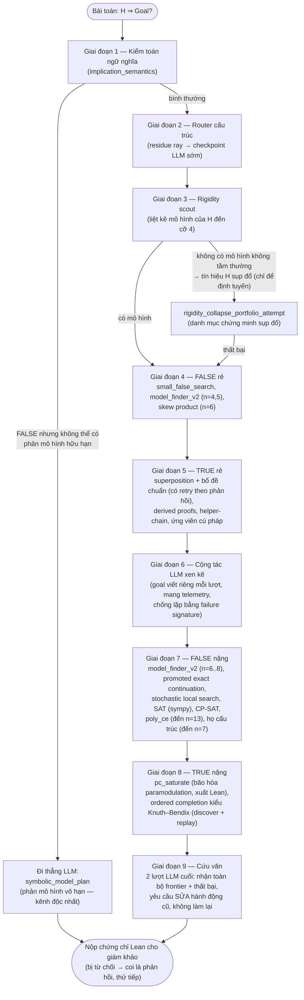
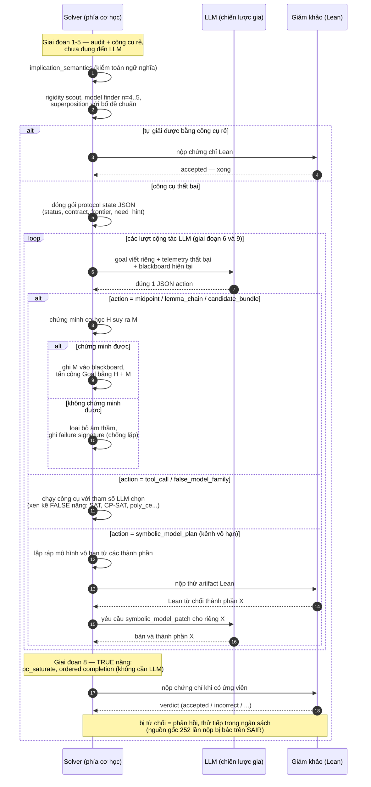

# Reja23 (EQT02-S00023) — Sơ đồ chiến lược

Sơ đồ hóa từ `SOLVER_STRATEGY.md` (Part 1). Nội dung: (1) vòng cộng tác LLM ↔ công cụ
cơ học, (2) vòng giải chính theo từng giai đoạn, (3) sequence diagram vòng đời một bài
toán, (4) kết quả benchmark đo được.

## 1. Ý tưởng cốt lõi — LLM điều hướng, công cụ cơ học chứng minh

Nguyên tắc: LLM **không bao giờ** viết chứng minh được nộp trực tiếp (trừ vài ngoại lệ
hẹp). Mọi gợi ý đều phải qua kiểm chứng cơ học; gợi ý hỏng bị vứt, thất bại của công cụ
được đóng gói thành telemetry (`sair-collab-protocol-v0`) nuôi vòng LLM kế tiếp.

## 2. Vòng giải chính — leo thang theo ngân sách

## 3. Sequence diagram — vòng đời một bài toán

Trục thời gian của một bài, thể hiện đúng thứ tự: công cụ rẻ chạy trước và không cần
LLM; chỉ khi thất bại, telemetry mới được đóng gói gửi cho LLM; mọi gợi ý của LLM đều
qua kiểm chứng cơ học trước khi được dùng; và việc bị giám khảo từ chối được coi là
phản hồi để thử tiếp — chính vòng "nộp → bác → nộp lại" này là nguồn gốc của 252 lần
nộp bị bác bỏ.

## 4. Kết quả benchmark

Toàn bộ số liệu dưới đây lấy từ các evidence pack trong `.scratch/engine-day/results/`
và bảng chốt trong `SOLVER_STRATEGY.md` (2026-08-19). Mỗi bảng ghi rõ file nguồn. Lưu ý
cách đọc: các file jsonl là kết quả của từng build ở từng thời điểm trong chiến dịch,
nên tên solver phía ta thay đổi theo build (`m00006` là bản cũ đầu chiến dịch,
`m6beam2` là bản chốt trên evaluation, `m6union` là bản chốt trên SAIR).

### 4.1 Bảng tổng — toàn bộ vũ trụ 2.469 bài đã gán nhãn

Nguồn: bảng chốt `SOLVER_STRATEGY.md`; số SAIR của reja23 tính từ `full.jsonl`.

| Solver | Evaluation (800) | SAIR (1.669) | Tổng (2.469) | Nộp bị bác bỏ |
|---|---|---|---|---|
| **EQT02-M00006 (ta)** | **786** | 1.644 | **2.430** | **0** |
| reja23 (EQT02-S00023) | 762 | 1.649 | 2.411 | 252 |

Điểm đáng chú ý mà bảng tổng che mất: trên riêng SAIR, reja23 giải được *nhiều hơn* ta
5 bài (1.649 so với 1.644) — nhưng đổi lại bằng 252 lần nộp chứng chỉ sai. Phần thắng
của ta nằm ở evaluation (+24) và ở độ tin cậy tuyệt đối khi nộp.

### 4.2 Evaluation 800 — theo từng band

Nguồn: ta = `beam_gate2.jsonl` (m6beam2) + số order5 chốt trong `SOLVER_STRATEGY.md`;
reja23 = `full.jsonl` + `xh_full.jsonl`.

| Band (200 bài/band) | Ta | reja23 | Chênh |
|---|---|---|---|
| normal | 196 | 200 | −4 |
| hard | 197 | 198 | −1 |
| extra_hard | 200 | 169 | **+31** |
| order5 | 193 | 195 | −2 |
| **Tổng** | **786** | **762** | **+24** |

Toàn bộ khoảng cách nằm ở `extra_hard`: 200/200 so với 169/200. Đây chính là band mà
witness bank + CG9 của ta phát huy — 74 bài hypothesis-eq168 trong evaluation đều bị
CG9 bác, trong đó có cụm 31 bài mà trước đó không solver nào chạm được (khớp đúng với
+31 ở band này).

### 4.3 SAIR 1.669 — theo từng corpus

Nguồn: ta = `union_sair.jsonl` (m6union); reja23 = `full.jsonl`.

| Corpus | Số bài | Ta | reja23 |
|---|---|---|---|
| normal | 1.000 | 994 | 997 |
| hard1 | 69 | 68 | 66 |
| hard2 | 200 | 191 | 193 |
| hard3 | 400 | 391 | 393 |
| **Tổng** | **1.669** | **1.644** | **1.649** |

### 4.4 Mẫu pilot 80 bài — cả làng solver

Nguồn: `nollm.jsonl` + `eulerv5.jsonl` — mẫu 20 bài/band, chạy KHÔNG có LLM. Đây là
mẫu thăm dò đầu chiến dịch, không phải kết quả chốt (bản ta trong run này là `m00006`
cũ, trước khi có engine bão hòa và witness bank); dùng để xếp hạng tương đối các đối
thủ thì được, suy ra tỷ lệ tuyệt đối thì không.

| Solver | normal | hard | extra_hard | order5 | Tổng /80 |
|---|---|---|---|---|---|
| reja23 | 20 | 20 | 17 | 20 | **77** |
| reja22 | 20 | 20 | 17 | 19 | 76 |
| m00006 (ta, bản cũ) | 12 | 14 | 16 | 14 | 56 |
| generalized | 16 | 9 | 14 | 14 | 53 |
| eulerv5 | 10 | 12 | 8 | 10 | 40 |
| suii0x | 11 | 8 | 0 | 13 | 32 |

Hai bản reja gần như bão hòa mẫu này ngay từ đầu — đó là lý do cả chiến dịch engine-day
được đo lường trực tiếp so với reja23 chứ không so với các solver còn lại.

### 4.5 Cụm eq168 — nơi CG9 quyết định

Nguồn: `eq168.jsonl` (16 bài hypothesis-eq168 lấy mẫu) và `SOLVER_STRATEGY.md`.

| Solver | eq168 sample (16 bài) |
|---|---|
| reja23 | 9/16 |
| generalized | 9/16 |
| ta (sau khi bank CG9) | 16/16 — và 74/74 trên toàn evaluation |

Central groupoid hữu hạn chỉ tồn tại ở cấp chính phương (1, 4, 9, 16, ...), nên mọi
tìm kiếm bảng đến cỡ 8 — kể cả danh mục FALSE rất rộng của reja23 — về nguyên tắc
không thể tìm ra CG9. Nó phải được *đặt tên* trong witness bank.

### 4.6 Tiến trình của ta trong chiến dịch (để đối chiếu)

Nguồn: commit log (`91565b6` → `2d69120` → `2738f26`) và `dose_gate.jsonl` /
`beam_gate.jsonl` (subcorpus `order5_true`, 100 bài TRUE của band order5).

| Mốc | Evaluation 800 | order5_true /100 |
|---|---|---|
| Trước chiến dịch | 570 | 41 |
| + engine bão hòa + CG9 + mở gate | 762 | 83 (`m6dose`) |
| + backtracker + harvest + beam + ladder | **786** | 94 (`m6beam`/`m6beam2`) |

### 4.7 Đối chiếu một dòng

| | reja23 | EQT02-M00006 (ta) |
|---|---|---|
| Triết lý | Độ rộng + LLM điều hướng | Bậc thang tất định, kiểm chứng trước khi nộp |
| Evaluation (800) | 762 | 786 |
| SAIR (1.669) | 1.649 | 1.644 |
| Tổng (2.469) | 2.411 | 2.430 |
| Nộp bị bác bỏ | 252 | 0 |
| Phụ thuộc LLM | Cấu trúc (routing, cầu nối) | Không (786/800 khi tắt LLM) |
