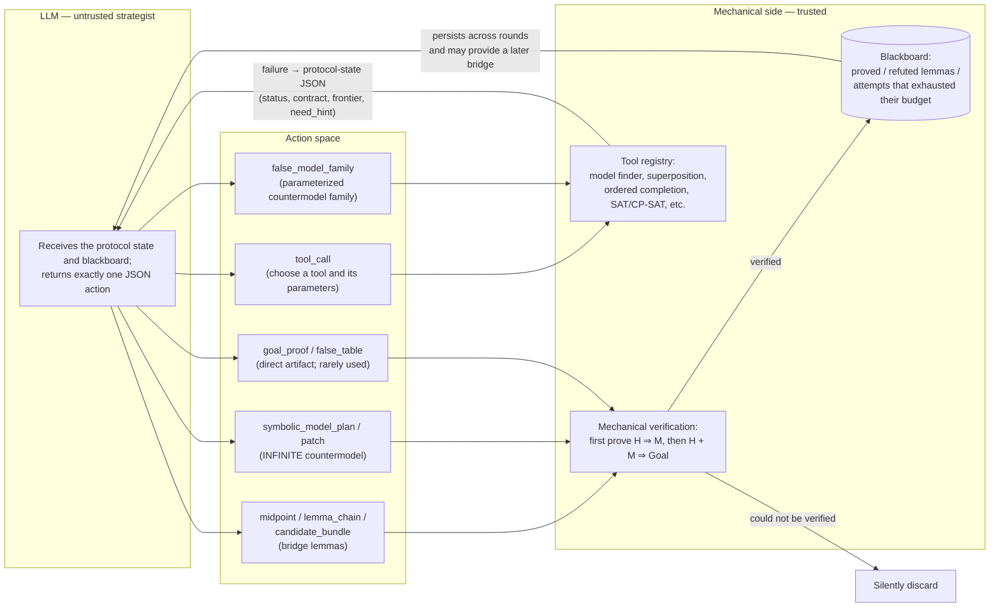
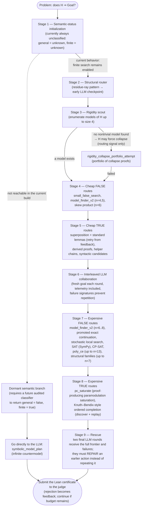
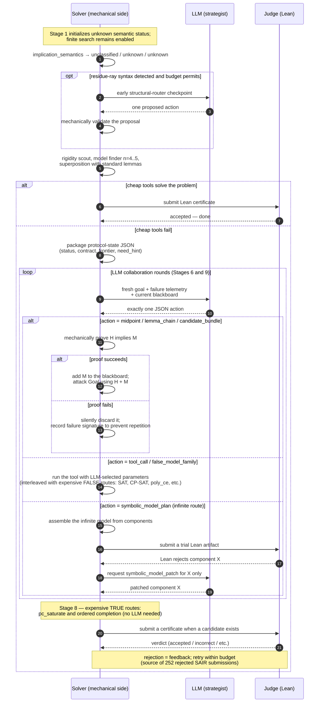

# Reja23 (EQT02-S00023) — Solver Strategy Diagram

This document visualizes Part 1 of `SOLVER_STRATEGY.md`. It contains: (1) the
collaboration loop between the LLM and trusted mechanical tools, (2) the main solving
loop organized into increasingly expensive stages, (3) a sequence diagram showing the
lifecycle of one problem, and (4) measured benchmark results.

## Before reading the diagrams

- `H` is the hypothesis equation that every candidate magma must satisfy.
- `Goal` is the equation that the solver must prove or disprove.
- `H ⇒ Goal` asks whether every magma satisfying `H` must also satisfy `Goal`.
- A **TRUE certificate** is a Lean proof of the implication.
- A **FALSE certificate** is a countermodel: a magma in which `H` holds but `Goal`
  fails.
- The LLM is treated as an idea generator, not as a trusted source. Lean and the
  deterministic tools are the trust boundary.

## 1. Core idea — the LLM navigates, mechanical tools prove

### What each component does

1. **LLM strategist:** Reads the current goal, results from earlier searches, and
   reusable facts on the blackboard. It proposes one next action in a constrained
   JSON format.
2. **`tool_call`:** Asks the trusted tool registry to run a specific proof or
   countermodel search with explicit parameters and a bounded budget.
3. **`midpoint`, `lemma_chain`, and `candidate_bundle`:** Propose one intermediate
   equation, an ordered sequence of equations, or several candidates. These are
   “bridges” intended to connect `H` to `Goal`; they are not accepted until the
   mechanical side proves them.
4. **`false_model_family`:** Describes a compact, parameterized family of finite
   operations. Mechanical code expands candidates, checks that `H` holds, and checks
   that `Goal` fails.
5. **`symbolic_model_plan` / `patch`:** Builds an infinite countermodel in Lean, or
   repairs only the part of a previously rejected symbolic model that failed. This is
   needed when no finite countermodel can exist.
6. **`goal_proof` / `false_table`:** Supplies a complete proof or a complete finite
   operation table directly. This route is rare because asking the LLM for smaller
   hints that tools can verify is usually safer.
7. **Mechanical verifier:** For a proposed midpoint `M`, it separately proves that
   `H` implies `M`, then uses `H` together with `M` to prove `Goal`. A proposed
   countermodel is likewise checked rather than trusted.
8. **Tool registry:** Contains the deterministic and proof-producing search methods,
   including finite-model search, superposition, ordered completion, SAT, and CP-SAT.
9. **Blackboard:** Retains useful results across LLM rounds: lemmas that were proved,
   candidates that were refuted, and attempts that ran out of budget. This prevents
   later rounds from starting from scratch.
10. **Feedback loop:** A failed tool call is converted into structured telemetry using
    `sair-collab-protocol-v0`. Fields such as the search frontier and `need_hint` tell
    the next LLM round what almost worked and what kind of help is needed.
11. **Silent discard:** An unverifiable suggestion contributes no fact to the final
    answer. It may still produce failure information, but it can never become a
    certificate by itself.

The governing rule is that the LLM normally never writes a proof that is submitted
without checking. Every suggestion must pass mechanical verification. Bad suggestions
are discarded, while useful failure details become input for the next collaboration
round.

## 2. Main solving loop — escalate with the available budget

This diagram emphasizes the **fall-through path**: if a stage finds no certificate,
the solver advances to the next, more expensive stage. If any stage does find a proof
or countermodel, the candidate is checked by the Lean judge immediately and the solver
can finish early.

### What each stage does

1. **Semantic-status initialization:** `implication_semantics` currently ignores the
   problem and returns `general_status = unknown`, `finite_status = unknown`, and
   `semantic_class = unclassified`. Consequently, it never disables finite-table
   search. Code for routing an audited `general = false, finite = true` classification
   to an infinite symbolic countermodel exists, but no current classifier or registry
   can produce that classification, so the branch is dormant.
2. **Structural router:** Examines the syntax of `H` for recognizable shapes. A
   residue-ray shape suggests a specialized infinite, residue-controlled operation
   family, so the solver asks the LLM early whether that route is appropriate.
3. **Rigidity scout:** Exhaustively looks for small nontrivial models of `H`, up to
   carrier size 4. Finding none is evidence that `H` may force every element to be
   equal or force a similarly rigid structure. It is only a routing hint, not a proof.
4. **Collapse-proof portfolio:** When the rigidity signal fires, tries several
   proof-producing chains of cancellation, projection, square, or constant laws. The
   aim is to prove that every model of `H` collapses to a trivial form, from which the
   goal follows automatically.
5. **Cheap FALSE routes:** Tries to disprove the implication quickly by finding a
   small finite operation table. It starts with sizes 4 and 5 and also tries a compact
   size-6 skew-product construction.
6. **Cheap TRUE routes:** Tries inexpensive ways to prove the implication: bounded
   superposition, standard auxiliary lemmas, mechanically derived facts, short helper
   chains, and candidates suggested by the equation's syntax. Failed searches can be
   retried using their closest proof frontier.
7. **Interleaved LLM collaboration:** Lets the LLM choose tools or propose bridge
   lemmas after it sees concrete mechanical feedback. A failure signature records each
   unsuccessful action so the LLM cannot waste later rounds by repeating it unchanged.
8. **Expensive FALSE routes:** Broadens the countermodel search to larger carriers and
   costlier algorithms. “Promoted exact continuation” turns a promising partial search
   into a more exact follow-up; stochastic search explores likely tables, SAT and
   CP-SAT encode the constraints for solvers, `poly_ce` tries polynomial operations,
   and structural families search compact algebraic constructions.
9. **Expensive TRUE routes:** Uses more powerful equational theorem proving.
   `pc_saturate` repeatedly applies proof-producing paramodulation rules. Ordered
   completion orients equations into rewrite rules, discovers a route to the target,
   and then replays that route as a checkable Lean proof.
10. **Rescue rounds:** Gives the LLM the complete search frontier and accumulated
    failures for two final attempts. It is explicitly asked to repair an almost-working
    action rather than repeat a search already known to fail.
11. **Judge submission:** The final artifact is Lean code, so the judge checks the
    result independently. Acceptance ends the solve; a rejection is recorded as
    structured feedback and another route may be attempted while budget remains.

The order is deliberately **cheap before expensive** and alternates between FALSE-side
countermodel search and TRUE-side proof search. This avoids committing the full budget
to the wrong answer direction too early.

## 3. Sequence diagram — lifecycle of one problem

This timeline shows the actual order of events. A residue-ray syntax match can trigger
one early LLM checkpoint; otherwise the cheap mechanical tools run first. Later LLM
calls receive packaged search telemetry. Every LLM suggestion is mechanically verified
before use, and a judge rejection becomes feedback for another attempt. This
submit–reject–resubmit loop accounts for reja23's 252 rejected submissions.

### How the sequence works

1. **Initialize and start searching:** The solver assigns the default unknown semantic
   status, optionally runs the residue-ray LLM checkpoint, and then tries its cheapest
   proof and countermodel tools.
2. **Finish immediately when possible:** If those tools produce a certificate, Lean
   checks it and acceptance ends the run.
3. **Package useful failure information:** If they fail, the solver records what was
   tried, the closest search frontier, and the specific hint needed next.
4. **Request exactly one action:** The LLM receives that context and must choose one
   tool call, bridge-lemma proposal, model family, or symbolic-model action.
5. **Verify the response:** The solver proves bridge lemmas, checks model families, or
   compiles symbolic artifacts. Unverified content is never trusted.
6. **Repair narrow failures:** If Lean rejects one component of an infinite model, the
   solver asks the LLM to patch only that component instead of rebuilding everything.
7. **Continue within budget:** Expensive mechanical proof tools and additional judge
   attempts continue until a certificate is accepted or the budget is exhausted.

## 4. Benchmark results

All figures below come from evidence packs in `.scratch/engine-day/results/` and the
final table in `SOLVER_STRATEGY.md` (2026-08-19). Each table names its source. The JSONL
files contain results from different solver builds created during the campaign, so our
solver name varies by run: `m00006` is the early build, `m6beam2` is the final
evaluation build, and `m6union` is the final SAIR build.

### 4.1 Overall results — all 2,469 labeled problems

Source: final table in `SOLVER_STRATEGY.md`; reja23's SAIR figure is calculated from
`full.jsonl`.

| Solver | Evaluation (800) | SAIR (1,669) | Total (2,469) | Rejected submissions |
|---|---|---|---|---|
| **EQT02-M00006 (ours)** | **786** | 1,644 | **2,430** | **0** |
| reja23 (EQT02-S00023) | 762 | 1,649 | 2,411 | 252 |

The overall table hides one notable result: on SAIR alone, reja23 solved five more
problems than our solver (1,649 versus 1,644), but did so with 252 incorrect certificate
submissions. Our advantage came from the evaluation set (+24) and from never submitting
an incorrect certificate.

### 4.2 Evaluation set of 800 — by band

Source: ours = `beam_gate2.jsonl` (`m6beam2`) plus the final order5 count in
`SOLVER_STRATEGY.md`; reja23 = `full.jsonl` plus `xh_full.jsonl`.

| Band (200 problems each) | Ours | reja23 | Difference |
|---|---|---|---|
| normal | 196 | 200 | −4 |
| hard | 197 | 198 | −1 |
| extra_hard | 200 | 169 | **+31** |
| order5 | 193 | 195 | −2 |
| **Total** | **786** | **762** | **+24** |

```mermaid
xychart-beta
    title "Evaluation by band — bar 1: ours (m6beam2), bar 2: reja23"
    x-axis [normal, hard, extra-hard, order5]
    y-axis "problems solved out of 200" 0 --> 200
    bar [196, 197, 200, 193]
    bar [200, 198, 169, 195]
```

The entire overall gap comes from `extra_hard`: 200/200 versus 169/200. This is the
band where our witness bank and CG9 matter. CG9 refuted all 74 problems with hypothesis
equation 168 in the evaluation set, including the cluster of 31 that no solver had
previously reached—exactly matching the +31 difference for this band.

### 4.3 SAIR set of 1,669 — by corpus

Source: ours = `union_sair.jsonl` (`m6union`); reja23 = `full.jsonl`.

| Corpus | Problems | Ours | reja23 |
|---|---|---|---|
| normal | 1,000 | 994 | 997 |
| hard1 | 69 | 68 | 66 |
| hard2 | 200 | 191 | 193 |
| hard3 | 400 | 391 | 393 |
| **Total** | **1,669** | **1,644** | **1,649** |

### 4.4 Pilot sample of 80 problems — all solvers

Source: `nollm.jsonl` plus `eulerv5.jsonl`. This sample contains 20 problems per band
and was run without an LLM. It was an early pilot, not the final result: our solver in
this run was the old `m00006`, before the saturation engine and witness bank. The table
is useful for relative ranking, but not for inferring final absolute success rates.

| Solver | normal | hard | extra_hard | order5 | Total /80 |
|---|---|---|---|---|---|
| reja23 | 20 | 20 | 17 | 20 | **77** |
| reja22 | 20 | 20 | 17 | 19 | 76 |
| m00006 (ours, old build) | 12 | 14 | 16 | 14 | 56 |
| generalized | 16 | 9 | 14 | 14 | 53 |
| eulerv5 | 10 | 12 | 8 | 10 | 40 |
| suii0x | 11 | 8 | 0 | 13 | 32 |

Both reja versions nearly saturated this sample from the beginning. That is why the
engine-day campaign measured itself directly against reja23 rather than the other
solvers.

### 4.5 Equation 168 cluster — where CG9 is decisive

Source: `eq168.jsonl` (a sample of 16 problems with hypothesis equation 168) and
`SOLVER_STRATEGY.md`.

| Solver | Equation 168 sample (16 problems) |
|---|---|
| reja23 | 9/16 |
| generalized | 9/16 |
| ours (after adding CG9 to the bank) | 16/16—and 74/74 across the full evaluation set |

Finite central groupoids exist only at square orders (1, 4, 9, 16, and so on).
Consequently, table searches only through size 8—including reja23's broad FALSE
portfolio—cannot find CG9 in principle. It has to be explicitly named in the witness
bank.

### 4.6 Our progress during the campaign

Source: commit history (`91565b6` → `2d69120` → `2738f26`) and `dose_gate.jsonl` /
`beam_gate.jsonl` for the `order5_true` subcorpus of 100 TRUE problems from the order5
band.

| Milestone | Evaluation (800) | order5_true /100 |
|---|---|---|
| Before the campaign | 570 | 41 |
| + saturation engine, CG9, and gate opening | 762 | 83 (`m6dose`) |
| + backtracker, harvest, beam, and ladder | **786** | 94 (`m6beam`/`m6beam2`) |

### 4.7 One-line comparison

| Measure | reja23 | EQT02-M00006 (ours) |
|---|---|---|
| Philosophy | Broad search guided by the LLM | Deterministic ladder; verify before submission |
| Evaluation (800) | 762 | 786 |
| SAIR (1,669) | 1,649 | 1,644 |
| Total (2,469) | 2,411 | 2,430 |
| Rejected submissions | 252 | 0 |
| LLM dependency | Structural: routing and bridge lemmas | None: scores 786/800 with the LLM disabled |

The comparison highlights the tradeoff: `reja23` explores more broadly and uses the
LLM to steer important choices, while `EQT02-M00006` relies on a fixed sequence of
verified methods. The latter scored higher across the combined benchmark and avoided
rejected submissions, but the table alone does not establish that it will dominate on
every problem set.
