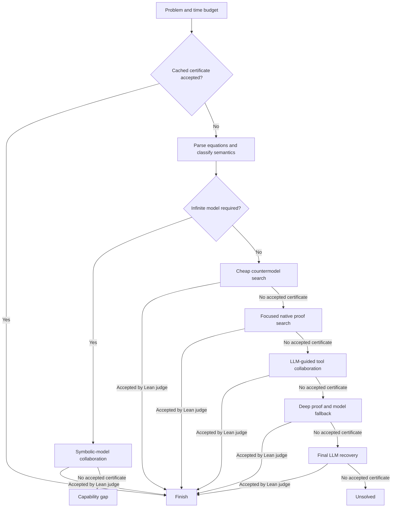
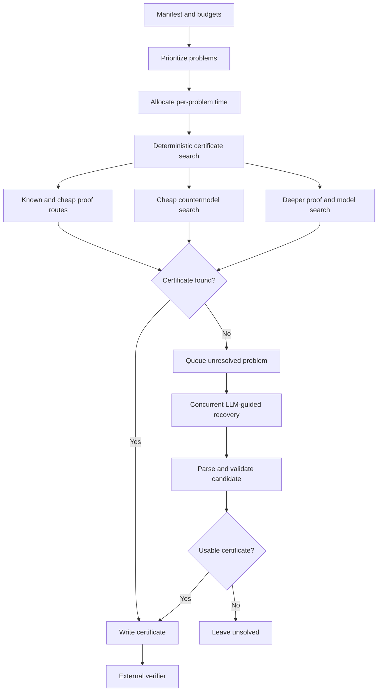

# `my_submission/solver.py` flow

The file is a staged certificate searcher: it parses one magma implication, tries increasingly expensive countermodel and proof strategies, asks an LLM to select or propose mechanically checked actions, and stops only when the Lean judge accepts a true or false certificate. Failed attempts feed later stages with diagnostics and remembered candidates.

## `my_submission/marathon/solverV3.py` flow

V3 is a budget-aware batch solver. It prioritizes the manifest, gives each problem a deterministic certificate-search pass, then spends the remaining token and time budget on concurrent LLM-guided recovery for unresolved problems. Every successful path writes either a Lean proof certificate or a finite countermodel certificate for external verification.

