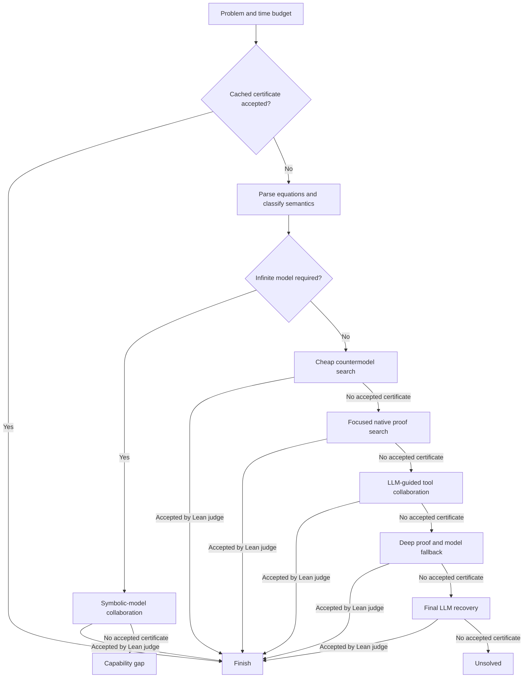

# `my_submission/solver.py` flow

The file is a staged certificate searcher: it parses one magma implication, tries increasingly expensive countermodel and proof strategies, asks an LLM to select or propose mechanically checked actions, and stops only when the Lean judge accepts a true or false certificate. Failed attempts feed later stages with diagnostics and remembered candidates.

