# reja EQT02-S00023 — Orchestrator high-level

> File: `examples/solo/demos/reja/EQT02-S00023.py:7055` (`solve()`), ~7247 LOC.  
> Delegation model: trusted deterministic **orchestrator** in Python ↔ untrusted **LLM** proposer ↔ trusted **Lean `judge`** verifier. LLM hints never trusted — every bridge lemma is re-proved from `H`, every table re-checked by `decideFin!`.

## 1. What the orchestrator is

A staged **deterministic pipeline + LLM repair loops**. It never searches blindly — each phase emits rich `protocol_state` telemetry (`need_hint`, `frontier`, `closest_pairs`, `tried_routes`) which is fed back as `mechanical_feedback` to steer the next LLM call. Two hard trust boundaries:

* **Proof side** (`verdict=true`): only `Lean` accepting `make_true_code` counts; `decisive_true_judge_rejection` dedup-cache avoids re-sending exact same body.
* **False side** (`verdict=false`): `is_counterexample()` in Python + `decideFin!` on `Fin n` in Lean. Finite tables and `false_model_family` tables are expandable before judging.

Supporting subsystems used by every phase:

* `RenewableBudgetBroker:156` (`MidpointBudgetPolicy:106`) — slices LLM-proposed `lemma_chain`/`candidate_bundle` into grants `2.5 → 5.0 → 10.0` with scoring `relevance*0.35 + reuse*0.25 + exploration + progress*0.4 + companion_success*1.25 - failures*0.15`. Unstarted tasks prioritized, then highest score. `CandidateBlackboard` deduplicates `midpoint` payloads and persists `proved / refuted / budget-limited`.
* `small_model_rigidity_scout:611` — exhaustive H-only model search `n=2..4`, node_cap 250k, assignment_cap 16k, dual `cpu_budget+wall_budget`. Returns `no_nontrivial_model_through` vs `nontrivial_model_found` vs `incomplete`. Routing-only, never decides truth.

## 2. When it decides proof vs counter-example

There is no single classifier — it is a **priority waterfall** with shape triggers and failure-driven phase switches (`solve:7055`):

1. **Semantic gate** (`implication_semantics:264` → current code always `unclassified`; research place-holder for `finite_status=true + general_status=false` which would force `symbolic_model_plan` / `infinite_model_artifact` and block all `false_model_search`).
2. **Residue-ray shortcut** (`residue_ray_promising_h:1003` — lone var as terminal value under nested left translations). If true → one `try_llm_collaboration` round biased to `residue_ray_countermodel:1185` (medium cost, residue-controlled clamped-affine on `Bool×Nat`, proved involutive).
3. **Rigidity scout** (`small_model_rigidity_scout`). `complete_sizes=[2,3,4]` with 0 models → pushes `RigidityCollapsePortfolio` early; a model found → suppresses that portfolio and keeps false alive.
4. **Cheap false gate** before any heavy true work:
   * `small_false_search:594` — `witness_tables` (26 hand-curated 2..5 tables) + `structured_tables(6)` (min/max/left/right/affine/group/product) + exhaustive `n=2` enumeration, budget `min(4, 0.08*budget)`.
   * `false_model_search_detailed n=4,5` (`model_finder_v2`) budget `min(8, 0.08*budget)`. Hit → done. Miss → `false_failure_feedback` appended (feeds later LLM `false_route` cards).
5. **Shape-triggered cheap true** (only if predicate holds):
   * `standard_aux_plausible_h` (`one_sided_variables:475` ≠ ∅) → `standard_aux_superposition:4878` (`const/proj_l/proj_r/rowconst`).
   * `broad_grounding_orientable` → `broad_grounding_derived`.
   * `repeated_self_absorption_h` (`x = T[x,x,...]` + goal `x = compound`) → `helper_chain_portfolio:5779`.
   * Each gets 1–12 s. Feedback on first failure triggers `feedback_driven_aux_retry_action:6802` using superposition `frontier/closest_pairs`.
6. **Early LLM true** only for `repeated_self_absorption_h` (`max_rounds=2`, hint budget cap `6–12 s`). Otherwise skipped.
7. **Heavier false** `model_finder_v2 n=6,7,8` (45–90 s). Promoted exact continuation if prior miss had `next_action_policy`.
8. **LLM routing fork**:
   * `should_try_collaboration_first:6802` (`right_square_h_roles` ∨ `square_sandwich_h_roles` ∨ `rowconst_h_roles` ...) true **and** no `false_strategy_cards` → true-biased LLM (`max_rounds=2`).
   * `false_strategy_cards` present → false-preferred LLM (`prefer_false=True`, telemetry `native_false_failed_attempts[-3:]`).
9. **Late broad false portfolio** (still native, before deep true): `local_search + model_finder_v2(7,8) + sympy_sat + cp_sat + poly_ce + structured_ce` budget `90–120 s` (×0.5 remaining if sympy available).
10. **Deep true portfolio** `native_deep_true_candidates:5021` budget `0.15*remaining` capped `12–120 s`; then `ordered_completion:4743` if `standard_aux_plausible_h` and `remaining ≥35 s` (budget `125–180 s`).
11. **Late LLM true recovery** (`max_rounds=2` + `max_rounds=3`) with `prefer_false=False`, seeded with `false_failure_feedback[-3:] + deep_failure_feedback + completion_failure_feedback + late_llm_feedback`. `false_model_search` now explicitly suppressed unless concrete untried route. Returns `unsolved` otherwise.

In short: **interleaved optimistic waterfall** — cheap false → cheap shape-matched true → heavier false → heavier true — with `rigidity_scout` and `false_failure_feedback` dynamically re-weighting. LLM phases are `phase_directive`-gated (`prefer_false=true|false|balanced` in `llm_context:6678`) and never allowed to repeat `diagnostic_highlights.tried_routes`.

## 3. Cheap vs expensive strategies

From `TOOL_REGISTRY:260` `cost` + actual budgets in `solve`/`tool_advice:5960`:

| cost | tools / routes | typical budget | feedback |
|---|---|---|---|
| **cheap** (deterministic, focused) | `right_square_chain`, `square_sandwich_chain`, `rowconst_certificates`, `grounding_derived` | 0.1–1 s each (invoked via `proof_candidates`, not budgeted) | `basic`/`structured` — hit-or-miss |
| **medium** | `forward_saturation` (bounded h-instantiation → `grind`), `helper_chain_portfolio`, `broad_grounding_derived`, `collapse_certificates`, `rigidity_collapse_ladder`, `proof_battery`, `grounding_h`, `deep_saturation`, `lemma_hint`/`lemma_chain` (midpoint, brokered), `standard_aux_superposition`, `false_model_family` (compact affine family 2–8), `residue_ray_countermodel` | 2–12 s per call; helper portfolio 12–36 s; `false_model_family` 8 s; `standard_aux` 4–8 s | `rich`/`structured` — returns `frontier/closest_pairs/diagnostics` to repair |
| **expensive** | `goal_superposition` (bounded proof-carrying paramodulation), `ordered_completion` (simplification-ordered completion + Lean replay), `false_model_search` family (`model_finder_v2` goal-directed Skolem search, `local_search`, `cp_sat` OR-Tools, `sympy_sat`, `poly_ce` polynomial, `skew_product 2×3` quotients, `structured_ce`), `infinite_model_artifact` / `symbolic_model_plan` (Type-level `ℕ`/`Bool×Nat`) | `false_model_search` 8–120 s across phases (late portfolio 90–120 s); `ordered_completion` 125–180 s; `goal_superposition` 8 s; `rigidity_collapse_portfolio` 40–180 s | `rich` / `judge_exact` — full Lean diagnostics; `residue_ray`/`symbolic_model` also map error line→`failed_parts` |

Cheap = one-equation renderers; medium = portfolio/bounded search with good repair hints; expensive = superposition/completion/CP-SAT exhaustive.

## 4. Architecture

```mermaid
flowchart TD
    A["Problem H => G<br/>parse_equation"] --> B{"Semantic gate<br/>implication_semantics"}
    B -->|"requires_infinite_model<br/>(currently stub)"| LLM_INF[/"LLM symbolic_model_plan<br/>infinite carrier"/]
    B -->|"ordinary"| C{"Residue-ray shape?<br/>residue_ray_promising_h"}
    C -->|yes| LLM_RAY[/"LLM residue_ray_countermodel<br/>Bool×Nat involutive"/]
    C -->|no| D["Rigidity scout<br/>small_model_rigidity_scout n=2..4<br/>cheap · routing-only"]
    LLM_RAY --> D

    D --> E["Cheap false gate<br/>small_false_search<br/>witness + structured(6) + n=2 enum<br/>+ model_finder_v2 n=4,5"]
    E -->|"found → try_false_attributed<br/>decideFin!"| DONE_FALSE1{{"ACCEPT false"}}
    E -->|"miss → false_failure_feedback"| F

    F --> G{"Rigidity = no model through 4?"}
    G -->|yes| H["Rigidity collapse portfolio<br/>medium-expensive 40-180s"]
    H -->|"body → judge_true_attributed"| DONE_TRUE1{{"ACCEPT true"}}
    H -->|"miss"| I["Early skew_product 2×3<br/>cheap false"]
    G -->|no| I

    I --> J{"one_sided_variables?<br/>standard_aux_plausible_h"}
    J -->|yes| K["standard_aux_superposition<br/>const/proj_l/proj_r/rowconst<br/>medium + feedback retry"]
    J -->|no| L["broad_grounding_derived?"]
    K --> L
    L --> M{"repeated_self_absorption?"}
    M -->|yes| N["helper_chain_portfolio<br/>nested_tail_absorption<br/>medium 12-36s"]
    M -->|no| O["proof_candidates<br/>battery / saturation"]
    N --> O

    O --> P{"repeated_self_absorption?"}
    P -->|yes| LLM_EARLY[/"LLM early true<br/>midpoint/lemma_chain<br/>2 rounds cap 6-12s"/]
    P -->|no| Q["model_finder_v2 n=6,7,8<br/>expensive false"]
    LLM_EARLY --> Q

    Q --> R{"false_failure → exact continuation?"}
    R --> S{"should_try_collaboration_first<br/>right_square / sandwich<br/>rowconst shape?"}
    S -->|true & no false cards| LLM_MID_TRUE[/"LLM mid true<br/>trusted tool / lemma_chain"/]
    S -->|false cards present| LLM_MID_FALSE[/"LLM mid false-preferred<br/>false_model_search<br/>recommended_next_call"/]
    LLM_MID_TRUE --> T
    LLM_MID_FALSE --> T

    T["Late broad false portfolio<br/>expensive<br/>local_search + mfv2 7,8<br/>+ sympy_sat + cp_sat<br/>+ poly_ce + structured_ce<br/>+ skew_product"]
    T --> U["Deep true portfolio<br/>expensive<br/>native_deep_true_candidates 12-120s"]
    U --> V{"standard_aux_plausible & remaining≥35s?"}
    V -->|yes| W["ordered_completion<br/>expensive 125-180s<br/>proof-carrying completion"]
    V -->|no| X
    W --> X["Late LLM true recovery<br/>2 rounds + 3 rounds<br/>prefer_false=False<br/>midpoint/lemma_chain +<br/>frontier repair"]
    X -->|"judge accepts"| DONE_TRUE2{{"ACCEPT true/false"}}
    X -->|"all miss"| UNSOLVED{{"unsolved"}}

    subgraph LLM_LOOP["try_llm_collaboration (shared)"]
        direction TB
        LC1["llm_context<br/>problem_analysis + analysis<br/>tool_registry + tool_advice<br/>phase_directive + fewshots<br/>candidate_blackboard<br/>mechanical_feedback[-3:]"]
        LC1 --> LC2[/"LLM JSON<br/>midpoint / midpoint_chain<br/>candidate_bundle → lemma_chain<br/>tool_call / false_table<br/>false_model_family<br/>residue_ray / symbolic_model_plan"/]
        LC2 --> LC3{"Capability gate<br/>capability_manifest"}
        LC3 -->|withheld| LC6["append gate_state<br/>→ next round"]
        LC3 -->|allowed| LC4["Mechanical verify<br/>hint_payload_attempt<br/>run_tool_call_detailed<br/>false_model_family_attempt<br/>residue_ray_attempt"]
        LC4 --> LC5{"Lean judge<br/>judge_true/false_attributed"}
        LC5 -->|accepted| DONE_LLM{{"ACCEPT"}}
        LC5 -->|rejected| LC6
        LC6 --> LC1
    end

    LLM_INF -.-> LLM_LOOP
    LLM_RAY -.-> LLM_LOOP
    LLM_EARLY -.-> LLM_LOOP
    LLM_MID_TRUE -.-> LLM_LOOP
    LLM_MID_FALSE -.-> LLM_LOOP
    X -.-> LLM_LOOP

    style DONE_FALSE1 fill:#f8d7da,stroke:#842029
    style DONE_TRUE1 fill:#d1e7dd,stroke:#0f5132
    style DONE_TRUE2 fill:#d1e7dd,stroke:#0f5132
    style DONE_LLM fill:#d1e7dd,stroke:#0f5132
    style UNSOLVED fill:#fff3cd,stroke:#664d03
    style LLM_LOOP fill:#e7f1ff,stroke:#0a58ca,stroke-dasharray: 5 5
```

### How the LLM loop is steered

`try_llm_collaboration:6805` (deadline `0.35*budget`, 1–3 rounds) builds `llm_context:6678` with `phase_directive`:
* `prefer_false=True` → block `standard_aux/proof_battery/forward_saturation/goal_superposition`, force `false_model_search/false_model_family/residue_ray/midpoint`.
* `prefer_false=balanced` with `false_strategy_cards` → same but allow `midpoint`.
* default → prefer true tool/midpoint, deprioritize false unless concrete route exists.
Dedup via `failed_signatures` + `tried_false_routes` + `compact_tool_signature`; repair via `normalize_llm_action:6483` and `apply_false_route_memory:6457`. `protocol_state` carries `need_hint` + `suggested_next_actions` (e.g. `graph_search_state` `frontier/closest_pairs`, `false_route` `recommended_next_call`).

## 5. Key files

* Orchestrator: `examples/solo/demos/reja/EQT02-S00023.py:7055`
* Tool contracts: `examples/solo/demos/reja/EQT02-S00023.py:260` (`TOOL_REGISTRY`)
* Budget broker: `examples/solo/demos/reja/EQT02-S00023.py:106` / `156`
* False search detailed: `examples/solo/demos/reja/EQT02-S00023.py:1300` onward (`propagation_model_finder`, `goal_directed_model_finder`, `cp_sat`, `skew_product`, `poly_ce`)
* Midpoint consumer: `examples/solo/demos/reja/EQT02-S00023.py:5096` (`generic_midpoint_chain_attempt`)
* LLM loop: `examples/solo/demos/reja/EQT02-S00023.py:6805` / `6678`

